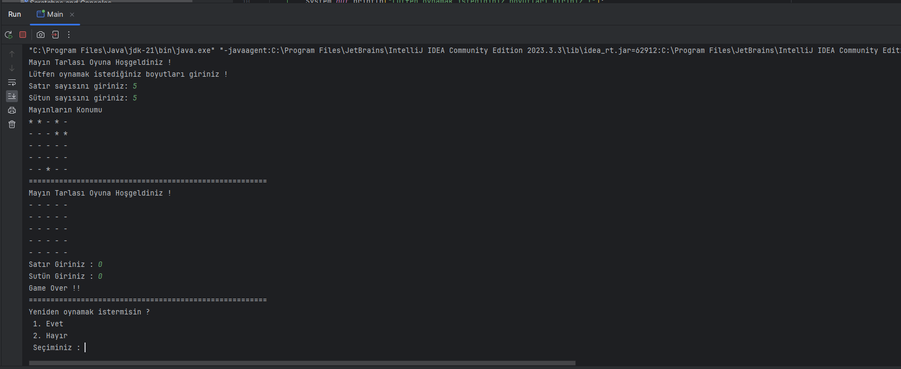
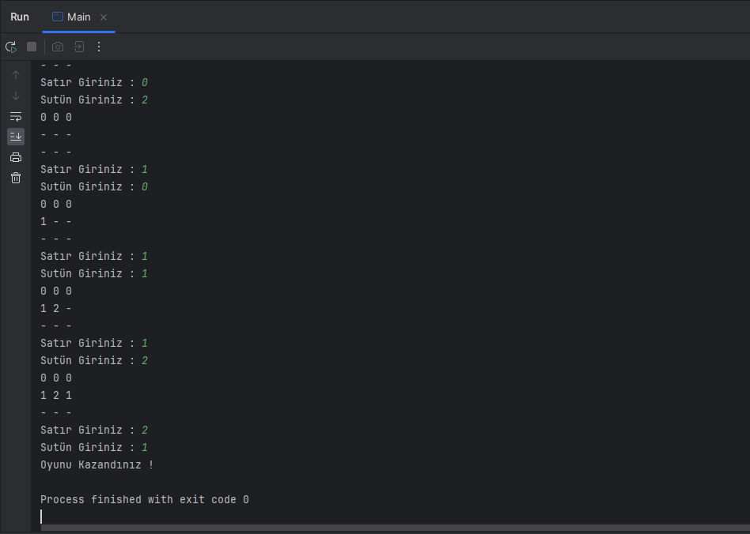

# Mayın Tarlası Oyunu

Bu proje Java dilinde metin tabanlı Mayın Tarlası oyununu içermektedir.

## Oyun Kuralları

- Oyun metin tabanlıdır.
- Proje çift boyutlu diziler kullanılarak yapılmalıdır.
- MineSweeper sınıfı içerisinde tasarlanmalıdır. Metodlar kullanılarak kod tekrarı önlenmelidir.
- Kullanıcı matris boyutunu (satır ve sütun sayısını) belirlemelidir. Minimum 2x2 boyutunda matris girişine izin verilmeli, 2x2'den küçük değer girişlerinde kullanıcıya uyarı verilmeli ve tekrar satır ve sütun girmesi istenmelidir.
- Diziye ait eleman sayısının çeyreği (elemanSayisi / 4) kadar rastgele mayın yerleştirilmelidir. Mayın sayısı, eleman sayısı/4'ten az ya da çok olmamalıdır.
- Mayınlar "*" sembolü ile gösterilmelidir. Açılmamış kutucuklar "-" sembolü ile gösterilmelidir.
- Kullanıcının girdiği noktada mayın varsa, oyunu kaybetmelidir. Eğer kullanıcının girdiği noktada mayın yoksa, noktanın etrafındaki tüm komşu konumlara bakılmalı ve bu komşu noktalardaki mayınların sayısının toplamı kullanıcının girmiş olduğu koordinata yazılmalıdır. Eğer kullanıcının girdiği noktada mayın yoksa ve çevresinde de mayın yoksa, "0" değeri yazılmalıdır.
- Kullanıcı hiç bir mayına basmadan tüm noktaları açarsa oyunu kazanmalıdır.
- Kullanıcı oyunu kaybeder ise tekrardan oyuna başlamak isteyip istemediği sorulur.

## Nasıl Oynanır?

1. Proje klonlanır veya indirilir.
2. Proje bir Java IDE'sinde açılır.
3. `Main.java` dosyası çalıştırılır.
4. Oyun yönergeleri ekranda görüntülenir ve kullanıcı adımları takip eder.

## Örnek Ekran Görüntüsü

